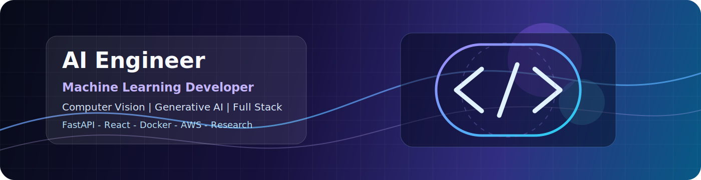

<div align="center">
  
</div>

<div align="center">
  
</div>

<h1 align="center">AI Engineer | Machine Learning Developer | Full Stack Engineer</h1>

<div align="center">
  <a href="https://git.io/typing-svg">
    
  </a>
</div>

<div align="center">
  
  
  
  
  
</div>

<br />

<div align="center">
  <a href="mailto:harshwadari@gmail.com">
    
  </a>
  <a href="https://www.linkedin.com/in/harsh-wadari/">
    
  </a>
  <a href="https://github.com/harshwadari">
    
  </a>
  <a href="https://my-portfolio-harsh-34.vercel.app/">
    
  </a>
</div>

---

## About

I am **Harsh Wadari**, a Data Engineering undergraduate from Mumbai focused on building AI-powered products across **machine learning, computer vision, generative AI, and full stack engineering**.

My work sits at the intersection of applied ML and product engineering: I enjoy turning models into usable systems with clean APIs, reliable backends, responsive frontends, and measurable user impact. I have built projects using Python, Scikit-Learn, OpenCV, FastAPI, React, Node.js, MongoDB, Docker, and AWS, and I have solved **400+ DSA problems** across coding platforms.

I am currently sharpening my skills in production-grade ML systems, computer vision pipelines, LLM applications, and research-oriented engineering.

<div align="center">

| Open To | Interests | Current Direction |
|---|---|---|
| AI/ML Internships | Computer Vision | End-to-end ML deployment |
| Software Engineering Internships | Generative AI | FastAPI + React AI products |
| Research Collaboration | Applied Machine Learning | Model evaluation and MLOps |
| Open Source Work | Data-centric AI | Practical developer tools |

</div>

---

## Tech Stack

<div align="center">

### Languages


### Frontend


### Backend and Databases


### Cloud, DevOps, and Tooling


### AI, ML, and Data


</div>

---

## AI / ML Expertise

| Domain | Proficiency | Details |
|---|---:|---|
| Machine Learning | Advanced Beginner to Intermediate | Classification, feature engineering, model evaluation, SVM, KNN, Scikit-Learn workflows |
| Computer Vision | Intermediate | OpenCV preprocessing, HSV segmentation, texture extraction, image classification pipelines |
| Generative AI | Intermediate | Resume parsing, job matching, interview question generation, structured AI reports using Google GenAI |
| Backend for AI | Intermediate | FastAPI, REST APIs, model serving, confidence scoring, batch prediction flows |
| Data Analysis | Intermediate | NumPy, Pandas, Matplotlib, exploratory analysis, feature preparation |
| Full Stack AI Products | Intermediate | React, Vite, Tailwind, Node.js, Express, MongoDB, auth, dashboard-style UX |
| MLOps Foundations | Growing | Docker, Linux, AWS fundamentals, reproducible deployment patterns |
| Research Engineering | Growing | Literature-driven project development, experimentation, benchmarking, applied AI problem framing |

---

## Featured Projects

<details open>
<summary><strong>PrepWise AI - AI-Powered Interview Preparation Platform</strong></summary>

<br />

An end-to-end AI interview preparation platform that generates personalized interview reports from resumes, self-descriptions, and job descriptions.

| Attribute | Details |
|---|---|
| Stack | React, Vite, Tailwind CSS, Node.js, Express.js, MongoDB, Google GenAI, JWT, OAuth |
| Scale | Multi-step AI workflow covering resume parsing, job matching, report generation, and roadmaps |
| Performance | Generates match scores, skill gaps, strengths analysis, technical questions, and behavioral questions |
| Security | JWT authentication, Google OAuth, email OTP verification, password recovery workflows |
| Impact | Helps candidates convert raw profiles into targeted interview preparation plans |
| Repository | [GitHub](https://github.com/harshwadari/AI_Resume_Analyzer) |

**Engineering highlights**

- Built a full stack AI product with a recruiter-style scoring and feedback flow.
- Integrated Google GenAI for structured interview preparation insights.
- Implemented secure authentication, PDF parsing, and user-focused preparation roadmaps.

</details>

<details>
<summary><strong>Plant Disease Detection Platform - Computer Vision ML Application</strong></summary>

<br />

A plant disease detection system for tomato leaves, built with classical computer vision features and deployed through API and dashboard interfaces.

| Attribute | Details |
|---|---|
| Stack | Python, OpenCV, Scikit-Learn, FastAPI, Streamlit, NumPy, Pandas |
| Scale | 6 tomato leaf classes, 6,000 images, 54-dimensional feature vector |
| Performance | 90.75% test accuracy and 91.53% cross-validation accuracy |
| Security | API-first prediction workflow with controlled model inference endpoints |
| Impact | Supports single-image and batch prediction with confidence scoring |
| Repository | [GitHub](https://github.com/harshwadari/Plant-Disease-Classifier) |

**Engineering highlights**

- Designed an HSV segmentation and GLCM texture feature pipeline.
- Compared SVM RBF and KNN models with rigorous evaluation.
- Deployed a practical FastAPI service and Streamlit dashboard.

</details>

<details>
<summary><strong>Store Intelligence System - Computer Vision Retail Analytics</strong></summary>

<br />

A computer vision project concept focused on store intelligence, visual analysis, and operational insights for retail environments.

| Attribute | Details |
|---|---|
| Stack | Python, OpenCV, Computer Vision, Data Analysis |
| Scale | Retail scenario analysis and visual intelligence workflows |
| Performance | Designed for object-level and scene-level analytics |
| Security | Local-first analysis workflow with scope for privacy-aware deployment |
| Impact | Converts visual store data into measurable business observations |
| Repository | [GitHub](https://github.com/harshwadari/Store-Intelligence-System) |

**Engineering highlights**

- Applies computer vision to real-world retail operations.
- Demonstrates business-aware AI problem solving.
- Strong fit for AI/ML internship conversations around applied CV.

</details>

<details>
<summary><strong>Brain MRI Classification - Medical Imaging ML</strong></summary>

<br />

A machine learning project direction focused on medical image classification, model evaluation, and reliable ML experimentation.

| Attribute | Details |
|---|---|
| Stack | Python, OpenCV, Scikit-Learn, Deep Learning, Medical Imaging |
| Scale | Image classification pipeline for MRI scan analysis |
| Performance | Evaluation-first workflow for accuracy, recall, precision, and confusion matrix analysis |
| Security | Dataset-sensitive workflow with responsible handling assumptions |
| Impact | Shows applied AI interest in healthcare and high-stakes classification |
| Repository | [GitHub](https://github.com/harshwadari/Brain-MRI-Classification) |

**Engineering highlights**

- Emphasizes careful metrics beyond accuracy.
- Builds credibility in computer vision and healthcare AI.
- Useful research foundation for future deep learning extensions.

</details>

<details>
<summary><strong>AI Resume Analyzer - Profile Intelligence Tool</strong></summary>

<br />

An AI-assisted resume analysis system for extracting strengths, gaps, and role-aligned recommendations from candidate profiles.

| Attribute | Details |
|---|---|
| Stack | React, Node.js, Express.js, MongoDB, GenAI APIs, PDF Parsing |
| Scale | Resume-to-feedback workflow for candidate preparation |
| Performance | Structured scoring, recommendations, and improvement suggestions |
| Security | Authentication-aware product architecture |
| Impact | Converts resumes into actionable career preparation insights |
| Repository | [GitHub](https://github.com/harshwadari/AI_Resume_Analyzer) |

**Engineering highlights**

- Demonstrates GenAI product thinking.
- Connects natural language processing with practical career workflows.
- Strong portfolio anchor for AI application roles.

</details>

<details>
<summary><strong>Personal Finance Tracker - Full Stack Product</strong></summary>

<br />

A full stack finance tracking application concept for budgeting, transaction management, and dashboard-driven insights.

| Attribute | Details |
|---|---|
| Stack | React, Node.js, Express.js, MongoDB, Charting, Authentication |
| Scale | User-level transaction tracking and analytics |
| Performance | Dashboard-first experience for fast financial summaries |
| Security | User authentication and protected financial records |
| Impact | Demonstrates practical full stack product engineering |
| Repository | [GitHub](https://github.com/harshwadari/Personal-Finance-Tracker) |

**Engineering highlights**

- Focuses on clean CRUD flows and meaningful analytics.
- Shows product sense beyond AI-only projects.
- Useful for full stack internship positioning.

</details>

<details>
<summary><strong>Movie Recommendation System - Recommendation Engine</strong></summary>

<br />

A recommendation system project focused on similarity search, ranking, and personalized content discovery.

| Attribute | Details |
|---|---|
| Stack | Python, Pandas, Scikit-Learn, Streamlit, Recommendation Systems |
| Scale | Movie metadata processing and recommendation generation |
| Performance | Similarity-based retrieval with interpretable outputs |
| Security | Local dataset workflow with safe demo deployment options |
| Impact | Demonstrates recommender systems and applied ML fundamentals |
| Repository | [GitHub](https://github.com/harshwadari/Movie-Recommendation-System) |

**Engineering highlights**

- Applies vector similarity and ranking concepts.
- Builds an interactive recommendation experience.
- Complements computer vision and GenAI projects with classic ML.

</details>

<details>
<summary><strong>Final Year Research Project - Applied AI Research</strong></summary>

<br />

A research-driven AI project to be expanded as the final year topic matures.

| Attribute | Details |
|---|---|
| Stack | Python, Machine Learning, Research Methods, Experiment Tracking |
| Scale | Literature-backed problem framing and experimental validation |
| Performance | Benchmark-driven model comparison and analysis |
| Security | Responsible dataset handling and reproducible workflows |
| Impact | Builds a strong research story for AI/ML internship and graduate opportunities |
| Repository | Coming soon |

**Engineering highlights**

- Creates a place for research progress, papers, experiments, and findings.
- Supports a stronger academic + industry portfolio narrative.
- Can become a flagship profile section once the topic is finalized.

</details>

---

## Experience

<div align="center">

| Role | Organization | Timeline | Focus |
|---|---|---|---|
| AI Cloud Virtual Intern | Edunet Foundation, AICTE, IBM | 4 weeks | AI fundamentals, cloud concepts, applied AI learning |

</div>

**Scope of work**

- Completed a structured AI Cloud virtual internship with Edunet Foundation, AICTE, and IBM.
- Strengthened fundamentals in artificial intelligence, cloud solution thinking, and applied technology workflows.
- Connected academic learning with practical AI systems and cloud-enabled product development.

**Skills:** `Artificial Intelligence` `Cloud Computing` `IBM SkillsBuild` `Applied AI` `Problem Solving`

---

## Achievements

<div align="center">

| Recognition | Details |
|---|---|
| 400+ DSA Problems | Solved across coding platforms, strengthening algorithms and implementation speed |
| AI Cloud Virtual Internship | Completed 4-week AI Cloud internship with Edunet Foundation, AICTE, and IBM |
| Production AI Projects | Built AI resume analysis, interview preparation, and computer vision classification systems |
| Computer Vision Accuracy | Achieved 90.75% test accuracy and 91.53% cross-validation accuracy on plant disease classification |
| Recruiter-Ready Portfolio | Built projects across AI, ML, full stack, computer vision, and GenAI |

</div>

---

## Certifications

### IBM

<p>
  <a href="https://www.credly.com/badges/4869cebd-4083-4909-9257-6939729c07ad/linked_in_profile">
    
  </a>
  <a href="https://www.credly.com/badges/1feb2aac-9a12-4e7e-9b8d-3f5e6874ced8/linked_in_profile">
    
  </a>
</p>

### AICTE and Edunet Foundation

<p>
  <a href="https://drive.google.com/file/d/1kpV8GfWhjt4PS59SgoSbjPS-M-3VK8dT/view?pli=1">
    
  </a>
</p>

### AWS

<p>
  
</p>

### Oracle

<p>
  
</p>

### NPTEL

<p>
  
</p>

### Cisco

<p>
  
</p>

---

## Coding Profiles

<div align="center">
  <a href="https://codolio.com/profile/harshwadari">
    
  </a>
  <a href="https://leetcode.com/harshwadari">
    
  </a>
  <a href="https://www.geeksforgeeks.org/user/harshwadari/">
    
  </a>
  <a href="https://www.hackerrank.com/harshwadari">
    
  </a>
  <a href="https://www.codechef.com/users/harshwadari">
    
  </a>
</div>

---

## GitHub Analytics

<div align="center">
  
  
</div>

<div align="center">
  
</div>

---

## GitHub Trophies

<div align="center">
  
</div>

---

## Contribution Activity

<div align="center">
  
</div>

---

## Contribution Snake

<div align="center">
  <picture>
    <source media="(prefers-color-scheme: dark)" srcset="https://raw.githubusercontent.com/harshwadari/harshwadari/output/github-contribution-grid-snake-dark.svg" />
    <source media="(prefers-color-scheme: light)" srcset="https://raw.githubusercontent.com/harshwadari/harshwadari/output/github-contribution-grid-snake.svg" />
    
  </picture>
</div>

---

## WakaTime

<details>
<summary><strong>Optional coding activity</strong></summary>

<!--START_SECTION:waka-->
<!--END_SECTION:waka-->

</details>

---

## Current Focus

```yaml
learning:
  - Advanced machine learning workflows
  - Computer vision model development
  - Generative AI application architecture
  - Cloud deployment and Docker-based delivery

building:
  - AI interview preparation systems
  - Computer vision classification platforms
  - Full stack products with AI features
  - Recruiter-ready GitHub project documentation

exploring:
  - Research-backed ML experimentation
  - LLM-powered developer tools
  - MLOps fundamentals
  - Open source collaboration

open_to:
  - AI/ML internships
  - Software engineering internships
  - Computer vision projects
  - Research collaborations
```

---

## Repository Roadmap

```text
AI and Machine Learning
|-- PrepWise AI
|-- Brain MRI Classification
|-- Plant Disease Detection
|-- AI Resume Analyzer

Full Stack
|-- Personal Finance Tracker
|-- Movie Recommendation System

Computer Vision
|-- Store Intelligence System

DSA
|-- LeetCode Solutions
|-- Striver A2Z
```

---

## Connect

<div align="center">
  <a href="mailto:harshwadari@gmail.com">
    
  </a>
  <a href="https://www.linkedin.com/in/harsh-wadari/">
    
  </a>
  <a href="https://github.com/harshwadari">
    
  </a>
  <a href="https://my-portfolio-harsh-34.vercel.app/">
    
  </a>
</div>

---

<div align="center">
  <strong>Building AI systems that are practical, measurable, and useful.</strong>
</div>

<br />

<div align="center">
  
</div>

<div align="center">
  
</div>
